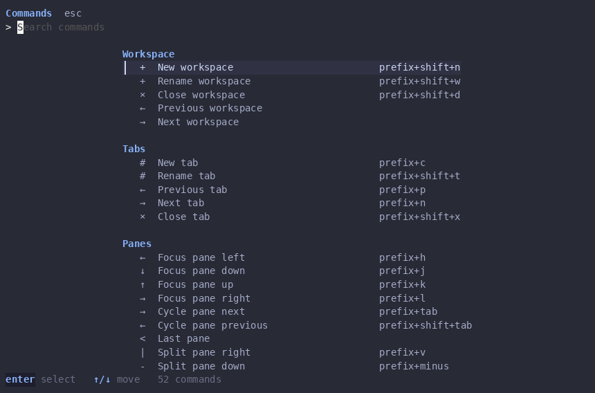

# herdr-palette (Go)

Fuzzy command palette for [Herdr](https://herdr.dev), rebuilt in Go on
[Bubble Tea](https://github.com/charmbracelet/bubbletea) + Bubbles + Lip Gloss.



* Hardcoded built-in catalog (Workspace/Tabs/Panes/Worktrees/Agents/Herdr),
  with `[keys]` remaps honored from `config.toml`.
* Auto-discovery of installed plugin actions via `herdr plugin action list`,
  subgrouped under `Custom` by plugin id. No per-plugin hardcoding.
* Prompt-mode commands (rename, worktree open/remove) prompt inline.
* Execution happens in the terminal, not the popup: the palette closes, then
  runs the command in the focused pane when it sits at a shell prompt, or in
  a fresh focused vertical split when the pane runs something (e.g. a TUI).
  Plugin actions stream their output to that pane via `herdr-palette invoke`.
* Theme follows the host terminal dynamically (termenv dark/light probe +
  adaptive colors); explicit Herdr `[theme]`/`[theme.custom]` hex overrides
  still win where set.

## Install

```sh
go build -o herdr-palette .
herdr plugin link .
```

Add to `~/.config/herdr/config.toml`:

```toml
[[keys.command]]
key = "ctrl+space"
type = "shell"
command = "\"$HERDR_BIN_PATH\" plugin pane open --plugin iancharters.herdr-palette --entrypoint picker"
description = "Open Herdr Palette"
```

```sh
herdr server reload-config
```

## Layout

```
main.go                  Bubble Tea entrypoint
internal/model           PaletteItem / Invocation types
internal/catalog         built-in command catalog
internal/herdr           herdr CLI client (run, neighbors, context)
internal/plugins         plugin action discovery + shortcut overlay
internal/config          config.toml remaps + item assembly
internal/theme           terminal-dynamic theme + Herdr overrides
internal/viewport        header-aware list windowing
internal/execute         invocation resolution + execution
internal/ui              Bubble Tea model (filter, groups, prompt, footer)
```

## Extending

* `ui.Matcher` / `ui.Executor` / `ui.KeyMap` are injectable — embed `ui.Model`
  or pass your own to add sources without forking.
* New built-ins go in `internal/catalog`; new resolvers in `internal/execute`.
